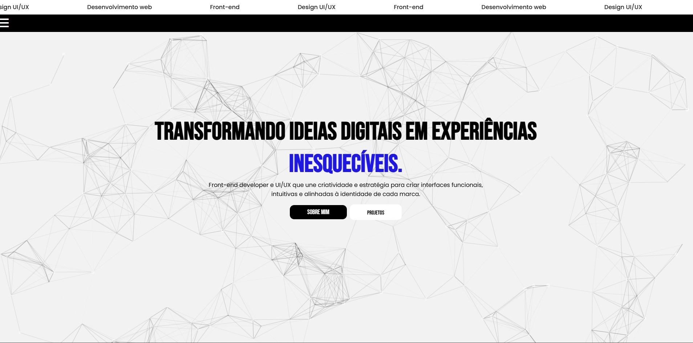

🎓 Desafio 3 - Portfólio Interativo
Bem-vindo ao repositório do Desafio 3, um projeto desenvolvido como parte do curso de faculdade com foco em praticar HTML, CSS e JavaScript de forma criativa e funcional. Este portfólio destaca minhas habilidades e trajetória de forma elegante, moderna e responsiva.

🔧 Tecnologias e Recursos Utilizados
✅ HTML, CSS e JavaScript
A base sólida da aplicação, garantindo estrutura, estilo e interatividade.

🎨 Design Responsivo
Layout adaptado para diferentes tamanhos de tela, proporcionando ótima experiência tanto em dispositivos móveis quanto desktops.

⚫⚪ Paleta Preto e Branco
Escolha minimalista para destacar o conteúdo com um contraste visual elegante e moderno.

🧩 Particles.js
Biblioteca usada para criar animações de partículas no fundo do site, adicionando dinamismo e sofisticação.

🖱️ Efeitos de Hover
Interações visuais ao passar o mouse sobre botões e links, deixando a navegação mais intuitiva e agradável.

🎭 Pseudo-elementos ::before e ::after
Detalhes sutis adicionados ao layout, enriquecendo a estética sem comprometer a performance.

🕒 Linha do Tempo
Seção dedicada à minha trajetória pessoal/profissional, apresentada de forma cronológica e visualmente atrativa.

📸 Prévia do Projeto

EN

🎓 Challenge 3 - Interactive Portfolio
Welcome to the Challenge 3 repository, a project developed as part of my college course focused on practicing HTML, CSS and JavaScript in a creative and functional way. This portfolio highlights my skills and trajectory in an elegant, modern and responsive way.

🔧 Technologies and Resources Used
✅ HTML, CSS and JavaScript
The solid foundation of the application, ensuring structure, style and interactivity.

🎨 Responsive Design
Layout adapted to different screen sizes, providing a great experience on both mobile devices and desktops.

⚫⚪ Black and White Palette
Minimalist choice to highlight the content with an elegant and modern visual contrast.

🧩 Particles.js
Library used to create particle animations in the background of the website, adding dynamism and sophistication.

🖱️ Hover Effects
Visual interactions when hovering over buttons and links, making navigation more intuitive and enjoyable.

🎭 Pseudo-elements ::before and ::after
Subtle details added to the layout, enriching the aesthetics without compromising performance.

🕒 Timeline
Section dedicated to my personal/professional trajectory, presented in a chronological and visually attractive format.