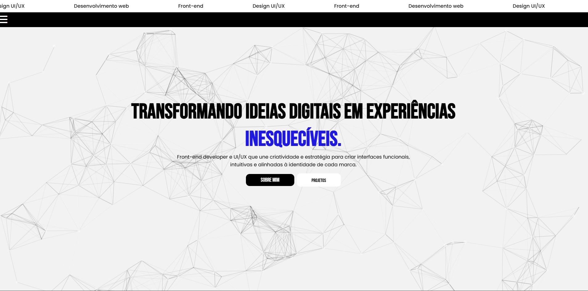

🎓 Desafio 3 - Portfólio Interativo
Bem-vindo ao repositório do Desafio 3, um projeto desenvolvido como parte do curso de faculdade com foco em praticar HTML, CSS e JavaScript de forma criativa e funcional. Este portfólio destaca minhas habilidades e trajetória de forma elegante, moderna e responsiva.

🔧 Tecnologias e Recursos Utilizados
✅ HTML, CSS e JavaScript
A base sólida da aplicação, garantindo estrutura, estilo e interatividade.

🎨 Design Responsivo
Layout adaptado para diferentes tamanhos de tela, proporcionando ótima experiência tanto em dispositivos móveis quanto desktops.

⚫⚪ Paleta Preto e Branco
Escolha minimalista para destacar o conteúdo com um contraste visual elegante e moderno.

🧩 Particles.js
Biblioteca usada para criar animações de partículas no fundo do site, adicionando dinamismo e sofisticação.

🖱️ Efeitos de Hover
Interações visuais ao passar o mouse sobre botões e links, deixando a navegação mais intuitiva e agradável.

🎭 Pseudo-elementos ::before e ::after
Detalhes sutis adicionados ao layout, enriquecendo a estética sem comprometer a performance.

🕒 Linha do Tempo
Seção dedicada à minha trajetória pessoal/profissional, apresentada de forma cronológica e visualmente atrativa.

📸 Prévia do Projeto

